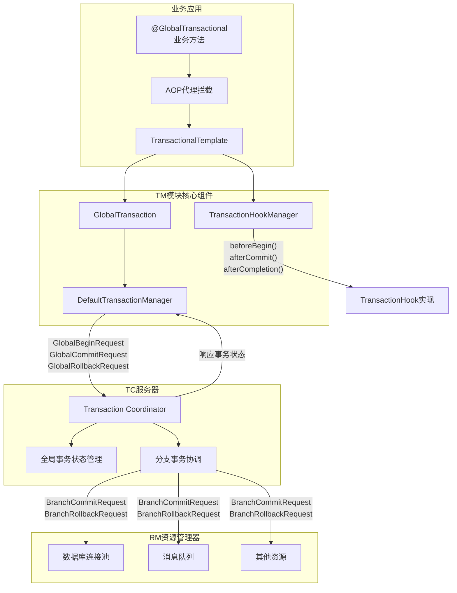
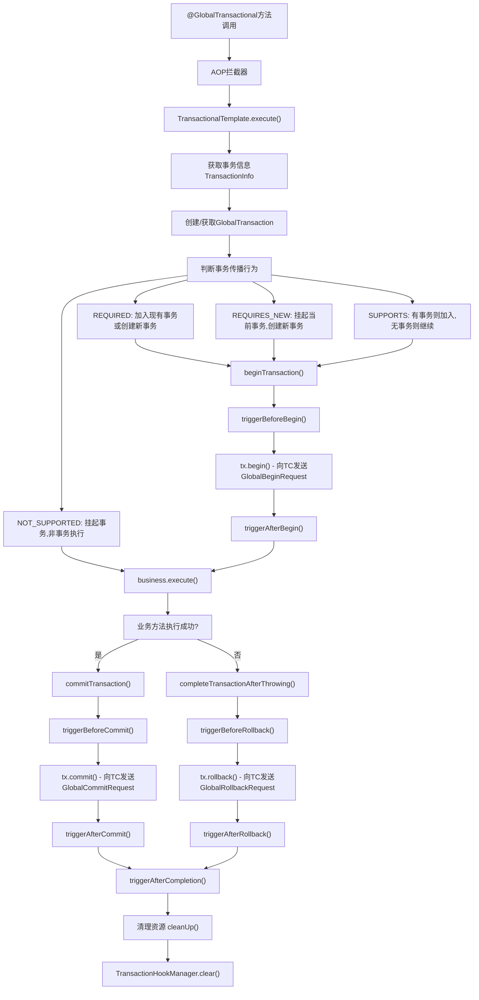
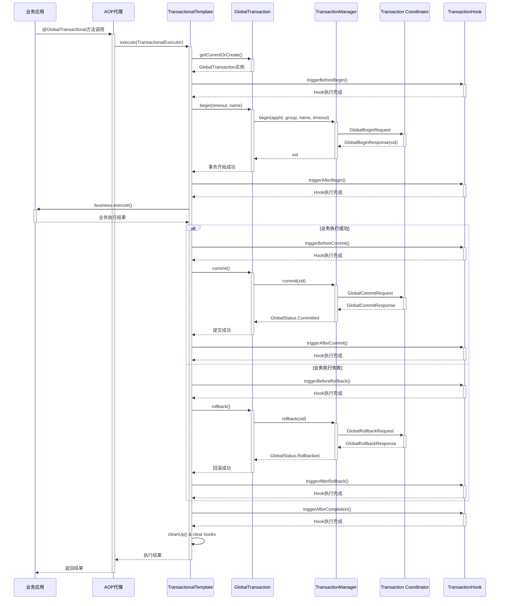
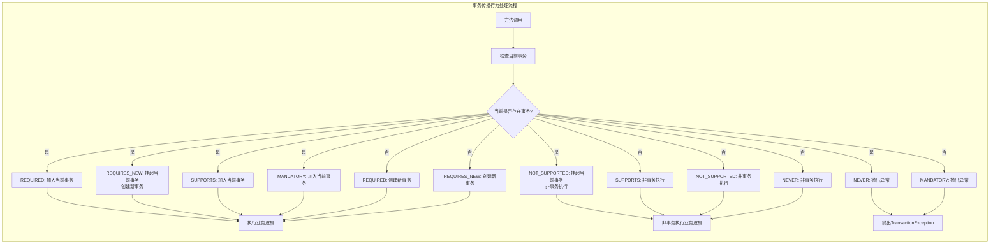

# 深入解析Seata TM模块：分布式事务管理器的设计与实现

## 前言

在微服务架构中，分布式事务是一个绕不开的技术挑战。Seata作为阿里巴巴开源的分布式事务解决方案，通过TC、TM、RM三大组件协同工作，优雅地解决了跨服务的数据一致性问题。本文将深入分析Seata中的TM（Transaction Manager）模块，探讨其架构设计、核心实现和扩展机制。

## 什么是TM模块？

TM（Transaction Manager）是Seata框架中的事务管理器，负责全局事务的生命周期管理。它定义了全局事务的边界，协调各个分支事务的执行，并最终决定全局事务的提交或回滚。

### TM的核心职责

- **事务边界定义**：通过`@GlobalTransactional`注解标识全局事务范围
- **事务生命周期管理**：控制全局事务的开始、提交、回滚
- **与TC通信**：向事务协调器(TC)发送事务指令
- **事务传播控制**：处理嵌套事务和事务传播行为
- **异常处理**：根据业务异常决定事务的最终状态

## TM模块架构解析

### 核心组件结构
```
tm/
├── TMClient.java                     # TM客户端初始化入口
├── DefaultTransactionManager.java    # TM核心实现，与TC通信
├── TransactionManagerHolder.java     # TM实例管理器（单例模式）
└── api/
    ├── GlobalTransaction.java            # 全局事务接口定义
    ├── DefaultGlobalTransaction.java     # 全局事务默认实现
    ├── GlobalTransactionContext.java    # 全局事务上下文管理
    ├── GlobalTransactionRole.java       # 事务角色枚举
    ├── TransactionalTemplate.java       # 事务模板类（核心执行逻辑）
    ├── TransactionalExecutor.java       # 业务执行器接口
    └── transaction/                      # 事务配置和扩展机制
        ├── TransactionInfo.java          # 事务配置信息
        ├── Propagation.java              # 事务传播行为
        ├── TransactionHook.java          # 事务生命周期Hook
        └── TransactionHookManager.java   # Hook管理器
```

### 整体架构图

下图展示了TM模块在整个Seata架构中的位置和交互关系：



### 关键设计模式

TM模块巧妙运用了多种设计模式：

1. **代理模式（Proxy Pattern）**：通过AOP代理拦截`@GlobalTransactional`方法
2. **模板方法模式（Template Method）**：`TransactionalTemplate`定义事务处理流程
3. **策略模式（Strategy Pattern）**：支持多种事务传播行为
4. **单例模式（Singleton）**：`TransactionManagerHolder`确保TM实例唯一性
5. **观察者模式（Observer）**：通过Hook机制监听事务生命周期事件

## 核心实现深度剖析

### 1. 全局事务的生命周期

下图展示了完整的全局事务执行流程：



让我们通过源码分析一个完整的全局事务执行流程：#### 事务开始阶段
```java
// DefaultGlobalTransaction.java
@Override
public void begin(int timeout, String name) throws TransactionException {
    if (role != GlobalTransactionRole.Launcher) {
        assertXIDNotNull();
        if (LOGGER.isDebugEnabled()) {
            LOGGER.debug("Ignore Begin(): just involved in global transaction [{}]", xid);
        }
        return;
    }
    
    assertXIDNull();
    String currentXid = RootContext.getXID();
    if (currentXid != null) {
        throw new IllegalStateException("Global transaction already exists," +
                " can't begin a new global transaction, currentXid = " + currentXid);
    }
    
    // 调用TM向TC发送开始事务请求
    xid = transactionManager.begin(null, null, name, timeout);
    status = GlobalStatus.Begin;
    RootContext.bind(xid);
    
    if (LOGGER.isInfoEnabled()) {
        LOGGER.info("Begin new global transaction [{}]", xid);
    }
}
```

#### 事务提交阶段
```java
// DefaultGlobalTransaction.java
@Override
public void commit() throws TransactionException {
    if (role == GlobalTransactionRole.Participant) {
        if (LOGGER.isDebugEnabled()) {
            LOGGER.debug("Ignore Commit(): just involved in global transaction [{}]", xid);
        }
        return;
    }
    
    assertXIDNotNull();
    
    int retry = COMMIT_RETRY_COUNT;
    try {
        while (retry > 0) {
            try {
                // 向TC发送提交请求
                status = transactionManager.commit(xid);
                break;
            } catch (Throwable ex) {
                LOGGER.error("Failed to report global commit [{}],Retry Countdown: {}, reason: {}", 
                    this.xid, retry, ex.getMessage());
                retry--;
                if (retry == 0) {
                    throw new TransactionException("Failed to report global commit", ex);
                }
            }
        }
    } finally {
        if (xid.equals(RootContext.getXID())) {
            suspend();
        }
    }
    
    if (LOGGER.isInfoEnabled()) {
        LOGGER.info("[{}] commit status: {}", xid, status);
    }
}
```

### 2. TransactionalTemplate：事务处理的核心模板

下图展示了事务执行的详细时序图：



`TransactionalTemplate`是TM模块最核心的类，它实现了完整的分布式事务处理逻辑：

```java
public Object execute(TransactionalExecutor business) throws Throwable {
    // 1. 获取事务信息
    TransactionInfo txInfo = business.getTransactionInfo();
    if (txInfo == null) {
        throw new ShouldNeverHappenException("transactionInfo does not exist");
    }
    
    // 2. 获取或创建全局事务
    GlobalTransaction tx = GlobalTransactionContext.getCurrentOrCreate();
    
    // 3. 计算事务传播行为
    Propagation propagation = txInfo.getPropagation();
    SuspendedResourcesHolder suspendedResourcesHolder = null;
    try {
        switch (propagation) {
            case NOT_SUPPORTED:
                suspendedResourcesHolder = tx.suspend();
                return business.execute();
            case REQUIRES_NEW:
                suspendedResourcesHolder = tx.suspend();
                break;
            case SUPPORTS:
                if (notExistingTransaction(tx)) {
                    return business.execute();
                }
                break;
            case REQUIRED:
                // 默认传播行为，继续执行
                break;
            default:
                throw new TransactionException("Not Supported Propagation:" + propagation);
        }
        
        // 4. 执行业务逻辑并处理事务
        try {
            beginTransaction(txInfo, tx);
            
            Object rs;
            try {
                // 执行业务方法
                rs = business.execute();
            } catch (Throwable ex) {
                // 发生异常，处理回滚逻辑
                completeTransactionAfterThrowing(txInfo, tx, ex);
                throw ex;
            }
            
            // 5. 提交事务
            commitTransaction(tx, txInfo);
            return rs;
            
        } finally {
            // 6. 清理资源
            triggerAfterCompletion(tx);
            cleanUp(tx);
        }
    } finally {
        // 恢复挂起的事务
        if (suspendedResourcesHolder != null) {
            tx.resume(suspendedResourcesHolder);
        }
    }
}
```

### 3. 事务传播机制

下图展示了不同传播行为的处理流程：



Seata支持多种事务传播行为，与Spring事务保���一致：

```java
public enum Propagation {
    REQUIRED(0),        // 当前有事务就加入，没有就创建新事务
    SUPPORTS(1),        // 当前有事务就加入，没有就以非事务方式执行
    MANDATORY(2),       // 当前必须有事务，没有就抛异常
    REQUIRES_NEW(3),    // 总是创建新事务，挂起当前事务
    NOT_SUPPORTED(4),   // 总是以非事务方式执行，挂起当前事务
    NEVER(5),          // 不能在事务中执行，有事务就抛异常
    NESTED(6);         // 嵌套事务（当前版本暂不支持）
}
```

## Hook机制：优雅的扩展点设计

### TransactionHook接口设计

Seata提供了Hook机制，允许开发者在事务的关键节点插入自定义逻辑：

```java
public interface TransactionHook {
    void beforeBegin();      // 事务开始前
    void afterBegin();       // 事务开始后
    void beforeCommit();     // 事务提交前
    void afterCommit();      // 事务提交后
    void beforeRollback();   // 事务回滚前
    void afterRollback();    // 事务回滚后
    void afterCompletion();  // 事务完成后（无论成功失败）
}
```

### Hook管理机制

下图展示了Hook的完整生命周期管理：

```mermaid
graph TD
    subgraph "Hook生命周期管理"
        A["应用启动"] --> B["Hook注册阶段"]
        B --> C["TransactionHookManager.registerHook()"]
        C --> D["Hook存储到ThreadLocal"]
        
        D --> E["事务开始"]
        E --> F["triggerBeforeBegin()"]
        F --> G["遍历执行所有Hook.beforeBegin()"]
        
        G --> H["事务执行中"]
        H --> I["triggerAfterBegin()"]
        I --> J["遍历执行所有Hook.afterBegin()"]
        
        J --> K["业务逻辑执行"]
        K --> L{"业务执行结果"}
        
        L -->|成功| M["triggerBeforeCommit()"]
        L -->|失败| N["triggerBeforeRollback()"]
        
        M --> O["执行Hook.beforeCommit()"]
        N --> P["执行Hook.beforeRollback()"]
        
        O --> Q["事务提交"]
        P --> R["事务回滚"]
        
        Q --> S["triggerAfterCommit()"]
        R --> T["triggerAfterRollback()"]
        
        S --> U["执行Hook.afterCommit()"]
        T --> V["执行Hook.afterRollback()"]
        
        U --> W["triggerAfterCompletion()"]
        V --> W
        W --> X["执行Hook.afterCompletion()"]
        X --> Y["TransactionHookManager.clear()"]
        Y --> Z["清理ThreadLocal中的Hook"]
    end
```



```java
public final class TransactionHookManager {
    // 使用ThreadLocal确保线程安全
    private static final ThreadLocal<List<TransactionHook>> LOCAL_HOOKS = new ThreadLocal<>();
    
    public static void registerHook(TransactionHook transactionHook) {
        if (transactionHook == null) {
            throw new NullPointerException("transactionHook must not be null");
        }
        List<TransactionHook> transactionHooks = LOCAL_HOOKS.get();
        if (transactionHooks == null) {
            LOCAL_HOOKS.set(new ArrayList<>());
        }
        LOCAL_HOOKS.get().add(transactionHook);
    }
    
    public static void clear() {
        LOCAL_HOOKS.remove(); // 事务完成后自动清理
    }
}
```### Hook实际应用示例

```java
// 示例1：事务性能监控Hook
public class TransactionPerformanceHook implements TransactionHook {
    private long startTime;
    
    @Override
    public void beforeBegin() {
        startTime = System.currentTimeMillis();
        MDC.put("txStartTime", String.valueOf(startTime));
    }
    
    @Override
    public void afterCompletion() {
        long endTime = System.currentTimeMillis();
        long duration = endTime - startTime;
        
        // 记录事务执行时间
        TransactionMetrics.recordDuration(duration);
        
        if (duration > 5000) { // 超过5秒记录慢事务
            LOGGER.warn("Slow transaction detected, duration: {}ms", duration);
        }
        
        MDC.remove("txStartTime");
    }
}

// 示例2：事务审计Hook
public class TransactionAuditHook implements TransactionHook {
    @Override
    public void beforeBegin() {
        String userId = SecurityContext.getCurrentUserId();
        String operation = RootContext.getOperationName();
        
        AuditLogger.logTransactionStart(userId, operation);
    }
    
    @Override
    public void afterCommit() {
        AuditLogger.logTransactionSuccess();
    }
    
    @Override
    public void afterRollback() {
        AuditLogger.logTransactionRollback();
    }
}

// 使用方式
@GlobalTransactional
public void businessMethod() {
    // 注册Hook
    TransactionHookManager.registerHook(new TransactionPerformanceHook());
    TransactionHookManager.registerHook(new TransactionAuditHook());
    
    // 业务逻辑...
}
```

## 与TC的通信机制

### DefaultTransactionManager实现

TM通过`DefaultTransactionManager`与TC进行通信：

```java
public class DefaultTransactionManager implements TransactionManager {
    
    @Override
    public String begin(String applicationId, String transactionServiceGroup, 
                       String name, int timeout) throws TransactionException {
        GlobalBeginRequest request = new GlobalBeginRequest();
        request.setTransactionName(name);
        request.setTimeout(timeout);
        
        GlobalBeginResponse response = (GlobalBeginResponse) syncCall(request);
        if (response.getResultCode() == ResultCode.Failed) {
            throw new TmTransactionException(TransactionExceptionCode.BeginFailed, 
                response.getMsg());
        }
        return response.getXid();
    }
    
    @Override
    public GlobalStatus commit(String xid) throws TransactionException {
        GlobalCommitRequest request = new GlobalCommitRequest();
        request.setXid(xid);
        
        GlobalCommitResponse response = (GlobalCommitResponse) syncCall(request);
        return response.getGlobalStatus();
    }
    
    @Override
    public GlobalStatus rollback(String xid) throws TransactionException {
        GlobalRollbackRequest request = new GlobalRollbackRequest();
        request.setXid(xid);
        
        GlobalRollbackResponse response = (GlobalRollbackResponse) syncCall(request);
        return response.getGlobalStatus();
    }
}
```

## 最佳实践与注意事项

### 1. 正确使用@GlobalTransactional注解

```java
// ✅ 正确用法：在业务入口方法上使用
@GlobalTransactional(name = "createOrder", rollbackFor = Exception.class)
public void createOrder(OrderRequest request) {
    // 调用多个服务
    orderService.createOrder(request);
    inventoryService.reduceStock(request.getProductId(), request.getQuantity());
    accountService.deductBalance(request.getUserId(), request.getAmount());
}

// ❌ 错误用法：不要在每个服务方法上都添加
@GlobalTransactional  // 不必要的注解
public void createOrder(OrderRequest request) {
    // 业务逻辑
}
```

### 2. 合理使用事务传播行为

```java
// 场景1：记录审计日志，不影响主业务事务
@GlobalTransactional(propagation = Propagation.REQUIRES_NEW)
public void auditLog(String operation) {
    // 独立事务，即使失败也不影响主业务
}

// 场景2：查询操作，支持事务但不强制
@GlobalTransactional(propagation = Propagation.SUPPORTS)
public List<Order> queryOrders(String userId) {
    // 如果在事务中就加入，否则非事务执行
    return orderMapper.selectByUserId(userId);
}
```

### 3. 异常处理和回滚规则

```java
@GlobalTransactional(
    rollbackFor = {BusinessException.class, RuntimeException.class},
    noRollbackFor = {ValidationException.class}
)
public void processOrder(OrderRequest request) {
    try {
        validateOrder(request); // ValidationException不会触发回滚
        processPayment(request); // BusinessException会触发回滚
    } catch (ValidationException e) {
        // 处理验证异常，事务继续
        throw new ServiceException("Invalid order data", e);
    }
}
```

### 4. Hook的使用建议

```java
// ✅ 推荐：创建通用的Hook基类
public abstract class BaseTransactionHook implements TransactionHook {
    protected final Logger logger = LoggerFactory.getLogger(getClass());
    
    @Override
    public void beforeBegin() {
        // 默认实现
    }
    
    @Override
    public void afterCompletion() {
        // 通用清理逻辑
        cleanupResources();
    }
    
    protected abstract void cleanupResources();
}

// 业务特定的Hook实现
public class OrderTransactionHook extends BaseTransactionHook {
    @Override
    public void beforeCommit() {
        // 发送订单创建事件
        eventPublisher.publishOrderCreated();
    }
    
    @Override
    protected void cleanupResources() {
        // 清理订单相关资源
    }
}
```

## 性能优化建议

### 1. 减少不必要的事务

```java
// ❌ 避免：只读操作使用全局事务
@GlobalTransactional
public List<Order> getAllOrders() {
    return orderService.findAll(); // 纯查询操作
}

// ✅ 推荐：只读操作不使用事务
public List<Order> getAllOrders() {
    return orderService.findAll();
}
```

### 2. 优化事务边界

```java
// ❌ 避免：事务边界过大
@GlobalTransactional
public void processLargeDataSet() {
    for (int i = 0; i < 10000; i++) {
        processRecord(i); // 处理大量数据
    }
}

// ✅ 推荐：适当的事务边界
public void processLargeDataSet() {
    List<DataBatch> batches = splitIntoBatches(data);
    for (DataBatch batch : batches) {
        processBatch(batch); // 分批处理
    }
}

@GlobalTransactional
private void processBatch(DataBatch batch) {
    // 处理单个批次
}
```

### 3. Hook性能考虑

```java
// ✅ 推荐：异步处理耗时操作
public class AsyncNotificationHook implements TransactionHook {
    private final ExecutorService executor = Executors.newFixedThreadPool(4);
    
    @Override
    public void afterCommit() {
        // 异步发送通知，不阻塞事务完成
        executor.submit(() -> {
            notificationService.sendSuccessNotification();
        });
    }
}
```

## 实际应用场景分析

### 场景1：电商订单处理

```java
@Service
public class OrderService {
    
    @GlobalTransactional(name = "createOrder", rollbackFor = Exception.class)
    public OrderResult createOrder(CreateOrderRequest request) {
        // 注册监控Hook
        TransactionHookManager.registerHook(new OrderPerformanceHook(request.getOrderId()));
        
        try {
            // 1. 创建订单
            Order order = orderRepository.createOrder(request);
            
            // 2. 扣减库存
            inventoryService.reduceStock(request.getItems());
            
            // 3. 扣减余额
            accountService.deductBalance(request.getUserId(), order.getTotalAmount());
            
            // 4. 发送通知（使用REQUIRES_NEW保证独立性）
            notificationService.sendOrderCreatedNotification(order);
            
            return OrderResult.success(order);
            
        } catch (InsufficientStockException e) {
            // 库存不足，记录但不回滚整个事务
            auditService.logStockShortage(request);
            throw e;
        } catch (InsufficientBalanceException e) {
            // 余额不足，回滚事务
            throw e;
        }
    }
}

// 订单性能监控Hook
public class OrderPerformanceHook implements TransactionHook {
    private final String orderId;
    private long startTime;
    
    public OrderPerformanceHook(String orderId) {
        this.orderId = orderId;
    }
    
    @Override
    public void beforeBegin() {
        startTime = System.currentTimeMillis();
        MDC.put("orderId", orderId);
    }
    
    @Override
    public void afterCommit() {
        long duration = System.currentTimeMillis() - startTime;
        OrderMetrics.recordOrderCreationTime(duration);
        LOGGER.info("Order {} created successfully in {}ms", orderId, duration);
    }
    
    @Override
    public void afterRollback() {
        LOGGER.warn("Order {} creation failed", orderId);
        OrderMetrics.incrementFailureCount();
    }
    
    @Override
    public void afterCompletion() {
        MDC.remove("orderId");
    }
}
```

### 场景2：批量数据处理

```java
@Service
public class DataMigrationService {
    
    public void migrateUserData(List<User> users) {
        int batchSize = 100;
        List<List<User>> batches = Lists.partition(users, batchSize);
        
        for (List<User> batch : batches) {
            try {
                migrateBatch(batch);
            } catch (Exception e) {
                LOGGER.error("Failed to migrate batch, continuing with next batch", e);
                // 单个批次失败不影响其他批次
            }
        }
    }
    
    @GlobalTransactional(propagation = Propagation.REQUIRES_NEW)
    private void migrateBatch(List<User> batch) {
        // 注册批处理监控Hook
        TransactionHookManager.registerHook(new BatchProcessingHook(batch.size()));
        
        for (User user : batch) {
            // 数据迁移逻辑
            migrateUserAccount(user);
            migrateUserProfile(user);
            migrateUserPreferences(user);
        }
    }
}
```

## 监控与调试

### 1. 事务监控Hook实现

```java
@Component
public class TransactionMonitoringHook implements TransactionHook {
    private static final Logger LOGGER = LoggerFactory.getLogger(TransactionMonitoringHook.class);
    
    @Autowired
    private MeterRegistry meterRegistry;
    
    private Timer.Sample timerSample;
    
    @Override
    public void beforeBegin() {
        timerSample = Timer.start(meterRegistry);
        Counter.builder("seata.transaction.begin")
                .tag("application", getApplicationName())
                .register(meterRegistry)
                .increment();
    }
    
    @Override
    public void afterCommit() {
        timerSample.stop(Timer.builder("seata.transaction.duration")
                .tag("status", "committed")
                .register(meterRegistry));
                
        Counter.builder("seata.transaction.commit")
                .tag("application", getApplicationName())
                .register(meterRegistry)
                .increment();
    }
    
    @Override
    public void afterRollback() {
        timerSample.stop(Timer.builder("seata.transaction.duration")
                .tag("status", "rollbacked")
                .register(meterRegistry));
                
        Counter.builder("seata.transaction.rollback")
                .tag("application", getApplicationName())
                .register(meterRegistry)
                .increment();
    }
}
```

### 2. 事务调试工具

```java
@Component
public class TransactionDebugHook implements TransactionHook {
    
    @Override
    public void beforeBegin() {
        if (LOGGER.isDebugEnabled()) {
            LOGGER.debug("=== Global Transaction BEGIN ===");
            LOGGER.debug("Thread: {}", Thread.currentThread().getName());
            LOGGER.debug("Stack trace: ", new Exception("Transaction begin point"));
        }
    }
    
    @Override
    public void afterBegin() {
        if (LOGGER.isDebugEnabled()) {
            String xid = RootContext.getXID();
            LOGGER.debug("Global transaction started: {}", xid);
        }
    }
    
    @Override
    public void beforeCommit() {
        if (LOGGER.isDebugEnabled()) {
            String xid = RootContext.getXID();
            LOGGER.debug("Preparing to commit transaction: {}", xid);
        }
    }
    
    @Override
    public void afterCompletion() {
        if (LOGGER.isDebugEnabled()) {
            LOGGER.debug("=== Global Transaction END ===");
        }
    }
}
```

## 总结

Seata的TM模块通过精心设计的架构和巧妙的实现，为开发者提供了简洁而强大的分布式事务管理能力。其主要特点包括：

1. **声明式事务管理**：通过注解简化分布式事务的使用
2. **灵活的传播机制**：支持多种事务传播行为
3. **优雅的扩展点**：Hook机制提供了强大的扩展能力
4. **完善的异常处理**：支持细粒度的回滚控制
5. **高性能设计**：通过合理的架构设计保证性能

### 关键技术亮点

- **流程图清晰展示**：通过多个Mermaid流程图直观展示了事务执行流程、架构关系和Hook生命周期
- **源码深度解析**：详细分析了核心类的实现逻辑和设计思想
- **实际应用指导**：提供了丰富的最佳实践和性能优化建议
- **监控调试支持**：展示了如何通过Hook机制实现事务监控和调试

理解TM模块的设计思想和实现细节，不仅有助于更好地使用Seata，也为我们设计分布式系统提供了宝贵的经验。在实际应用中，合理使用事务边界、正确配置传播行为、恰当利用Hook机制，能够帮助我们构建更加稳定和高效的微服务应用。

---

*本文基于Seata最新版本分析，详细源码可参考[Apache Seata](https://github.com/apache/incubator-seata)官方仓库。*