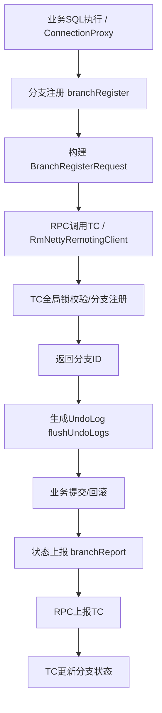
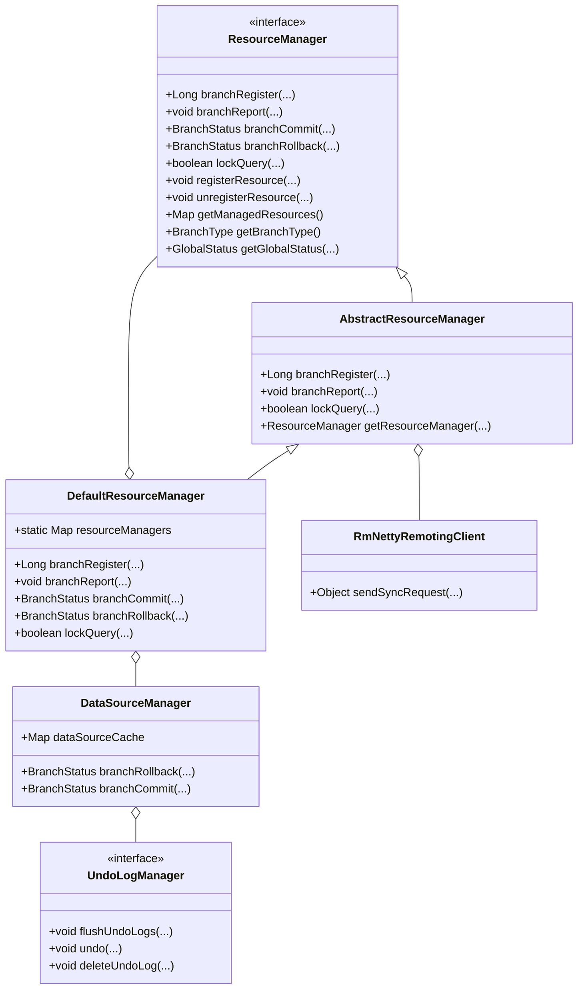

# 深度解析 Seata RM (Resource Manager) 模块源码与机制

> 本文将带你系统梳理 Seata 分布式事务框架中 RM（Resource Manager）模块的核心实现，包括分支注册、状态上报、全局锁、undo log、并发与异常处理等关键机制，并配以流程图、类图和源码解读，助你彻底吃透 RM 的设计与落地细节。

---

## 一、RM 模块定位与职责

在 Seata 架构中，RM（Resource Manager，资源管理器）主要负责：
- 管理本地资源（如数据库连接、数据源）
- 负责分支事务的注册、状态上报、回滚等
- 维护分支锁，保障分布式事务隔离性
- 与 TC（Transaction Coordinator，事务协调器）进行 RPC 通信

**典型场景**：AT 模式下，RM 代理业务 SQL，自动生成 undo log，拦截并注册分支事务，保障全局一致性。

---

## 二、核心流程全景图

### 1. 分支注册与状态上报



**流程说明**：
- 业务 SQL 通过 `ConnectionProxy` 拦截，进入全局事务流程
- 触发 `branchRegister`，构建分支注册请求，RPC 发送到 TC
- TC 校验全局锁、注册分支，返回分支ID
- 生成 undo log，业务提交/回滚后，RM 上报分支状态

---

## 三、关键机制源码解读

### 1. 分支注册调用链

- `ConnectionProxy.register()`  
- `DefaultResourceManager.branchRegister()`  
- `AbstractResourceManager.branchRegister()`  
- `RmNettyRemotingClient.sendSyncRequest()`  
- TC 端处理后返回分支ID

**核心数据结构**：

```java
public class BranchRegisterRequest {
    private String xid;           // 全局事务ID
    private BranchType branchType; // 分支类型
    private String resourceId;    // 资源ID
    private String lockKey;       // 行锁键值
    private String applicationData; // 应用自定义数据
}
```

#### 关键源码片段：分支注册

```java
// AbstractResourceManager.java
@Override
public Long branchRegister(
        BranchType branchType,
        String resourceId,
        String clientId,
        String xid,
        String applicationData,
        String lockKeys) throws TransactionException {
    try {
        BranchRegisterRequest request = new BranchRegisterRequest();
        request.setXid(xid);
        request.setLockKey(lockKeys);
        request.setResourceId(resourceId);
        request.setBranchType(branchType);
        request.setApplicationData(applicationData);

        // Send RPC to TC
        BranchRegisterResponse response =
            (BranchRegisterResponse) RmNettyRemotingClient.getInstance().sendSyncRequest(request);
        if (response.getResultCode() == ResultCode.Failed) {
            throw new RmTransactionException(
                response.getTransactionExceptionCode(),
                String.format("branch register failed, xid: %s, errMsg: %s ", xid, response.getMsg()));
        }
        return response.getBranchId();
    } catch (TimeoutException toe) {
        throw new RmTransactionException(TransactionExceptionCode.IO, "branch register timeout, xid:" + xid, toe);
    }
}
```

---

### 2. 状态上报机制

- 事务提交/回滚后，`ConnectionProxy.report()` 触发
- 通过 `branchReport()` 上报分支状态，支持重试机制（默认5次）

**状态上报数据结构**：

```java
public class BranchReportRequest {
    private String xid;
    private long branchId;
    private String resourceId;
    private BranchStatus status;
    private String applicationData;
    private BranchType branchType;
}
```

#### 关键源码片段：状态上报

```java
// AbstractResourceManager.java
@Override
public void branchReport(
        BranchType branchType, String xid, long branchId, BranchStatus status, String applicationData)
        throws TransactionException {
    try {
        BranchReportRequest request = new BranchReportRequest();
        request.setXid(xid);
        request.setBranchId(branchId);
        request.setStatus(status);
        request.setApplicationData(applicationData);

        BranchReportResponse response =
            (BranchReportResponse) RmNettyRemotingClient.getInstance().sendSyncRequest(request);
        if (response.getResultCode() == ResultCode.Failed) {
            throw new RmTransactionException(
                response.getTransactionExceptionCode(),
                String.format("branch report failed, xid: %s, errMsg: %s ", xid, response.getMsg()));
        }
    } catch (TimeoutException toe) {
        throw new RmTransactionException(TransactionExceptionCode.IO, "branch report timeout, xid:" + xid, toe);
    }
}
```

---

### 3. 全局锁管理

- **实现类**：`AbstractLockManager`、`DataBaseLockManager`、`RedisLockManager`、`FileLockManager`
- **加锁流程**：收集行锁，调用 `getLocker().acquireLock()`，如冲突则重试
- **锁冲突处理**：`LockRetryController` 控制重试，支持快速失败

**全局锁存储结构**：

- 内存锁：`ConcurrentHashMap<String, Set<String>>`
- 数据库锁：`lock_table`，主键为 row_key，记录 xid/branchId 等

#### 关键源码片段：全局锁获取

```java
// AbstractLockManager.java
@Override
public boolean acquireLock(BranchSession branchSession, boolean autoCommit, boolean skipCheckLock)
        throws TransactionException {
    if (branchSession == null) {
        throw new IllegalArgumentException("branchSession can't be null for memory/file locker.");
    }
    String lockKey = branchSession.getLockKey();
    if (StringUtils.isNullOrEmpty(lockKey)) {
        // no lock
        return true;
    }
    // get locks of branch
    List<RowLock> locks = collectRowLocks(branchSession);
    if (CollectionUtils.isEmpty(locks)) {
        // no lock
        return true;
    }
    return getLocker(branchSession).acquireLock(locks, autoCommit, skipCheckLock);
}
```

---

### 4. AT 模式 undo log

- **生成位置**：`ConnectionProxy.processGlobalTransactionCommit()` 调用
- **接口**：`UndoLogManager`，多数据库实现
- **存储表**：`undo_log`，字段包括 branch_id, xid, rollback_info 等
- **序列化**：支持 JSON/Kryo/Protobuf

#### 关键源码片段：undo log 生成

```java
// ConnectionProxy.java
private void processGlobalTransactionCommit() throws SQLException {
    try {
        register();
    } catch (TransactionException e) {
        recognizeLockKeyConflictException(e, context.buildLockKeys());
    }
    try {
        UndoLogManagerFactory.getUndoLogManager(this.getDbType()).flushUndoLogs(this);
        targetConnection.commit();
    } catch (Throwable ex) {
        LOGGER.error("process connectionProxy commit error: {}", ex.getMessage(), ex);
        report(false);
        throw new SQLException(ex);
    }
    if (IS_REPORT_SUCCESS_ENABLE) {
        report(true);
    }
    context.reset();
}
```

---

### 5. 分支事务回滚

- TC 发送 `BranchRollbackRequest`，RM 通过 `RmBranchRollbackProcessor` 处理
- 查询 undo log，反序列化，执行反向 SQL，删除 undo log

#### 关键源码片段：undo log 回滚

```java
// DataSourceManager.java
@Override
public BranchStatus branchRollback(
        BranchType branchType, String xid, long branchId, String resourceId, String applicationData)
        throws TransactionException {
    DataSourceProxy dataSourceProxy = get(resourceId);
    if (dataSourceProxy == null) {
        throw new ShouldNeverHappenException(String.format("resource: %s not found", resourceId));
    }
    try {
        UndoLogManagerFactory.getUndoLogManager(dataSourceProxy.getDbType()).undo(dataSourceProxy, xid, branchId);
        if (LOGGER.isInfoEnabled()) {
            LOGGER.info("branch rollback success, xid:{}, branchId:{}", xid, branchId);
        }
    } catch (TransactionException te) {
        StackTraceLogger.error(
                LOGGER,
                te,
                "branchRollback failed. branchType:[{}], xid:[{}], branchId:[{}], resourceId:[{}], applicationData:[{}]. reason:[{}]",
                new Object[] {branchType, xid, branchId, resourceId, applicationData, te.getMessage()});
        if (te.getCode() == TransactionExceptionCode.BranchRollbackFailed_Unretriable) {
            return BranchStatus.PhaseTwo_RollbackFailed_Unretryable;
        } else {
            return BranchStatus.PhaseTwo_RollbackFailed_Retryable;
        }
    }
    return BranchStatus.PhaseTwo_Rollbacked;
}
```

---

## 四、并发与异常处理

- **线程安全**：关键 Map 均为 `ConcurrentHashMap`
- **RPC 重试**：通道不可写最大重试2000次，状态上报最大重试5次
- **锁重试**：`LockRetryController` 控制，支持指数退避
- **异常处理**：网络异常自动重连/重试，事务异常分为可重试/不可重试

---

## 五、类图结构



---

## 六、总结与实践建议

- **RM 是 Seata 分布式事务的核心执行者**，负责分支注册、锁管理、undo log、回滚等关键环节
- **源码设计高度解耦**，支持多种事务模式和存储实现，便于扩展和二次开发
- **建议结合实际业务场景，深入理解分支注册、锁冲突、undo log 回滚等机制，提升分布式事务的可靠性与性能**

---

**如果你觉得本文有帮助，欢迎点赞、收藏、关注！如需更细致的源码解读或有其他分布式事务相关问题，欢迎留言交流！**

---

