# Hadoop 完全指南（一）：从零开始深入理解大数据生态核心基座

> 本文将带你从零开始系统学习 Hadoop 生态系统，涵盖其诞生背景、核心架构、关键组件、应用场景以及实践建议。无论你是大数据初学者还是希望深入理解 Hadoop 内部机制的开发者，本文都将为你提供一个清晰的学习路径。

---

## 一、Hadoop 诞生背景：大数据时代的挑战

### 1. 传统存储与计算的瓶颈

在 21 世纪初，随着互联网的爆炸式增长，企业面临着前所未有的数据挑战：

| 挑战 | 传统方案 | 问题 |
|------|---------|------|
| **海量数据存储** | 单机磁盘、SAN/NAS | 成本高昂，扩展困难 |
| **数据处理速度** | 单机 CPU 计算 | 处理时间随数据量线性增长 |
| **系统可靠性** | RAID、备份 | 硬件故障导致服务中断 |
| **成本压力** | 高端服务器 | ROI 低，维护成本高 |

### 2. Google 的三驾马车

2003-2006 年，Google 发布了三篇奠基性论文，开启了大数据时代：

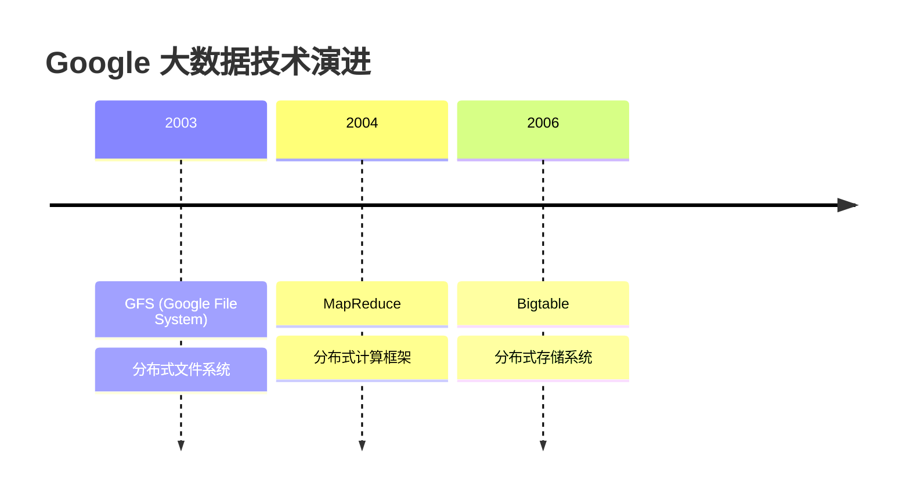

### 3. Hadoop 的诞生

**Doug Cutting**（Lucene 创始人）和 **Mike Cafarella** 在开发搜索引擎 Nutch 时，借鉴 Google 的论文，于 **2006 年** 创建了 Hadoop 项目，并于 **2008 年** 成为 Apache 顶级项目。

**名字由来**：Hadoop 来自 Doug Cutting 儿子的玩具大象的名字 🐘

---

## 二、Hadoop 核心架构概览

Hadoop 是一个**分布式系统基础架构**，由 Apache 基金会开发，主要解决**海量数据的存储与计算**问题。

### 1. 核心组件架构

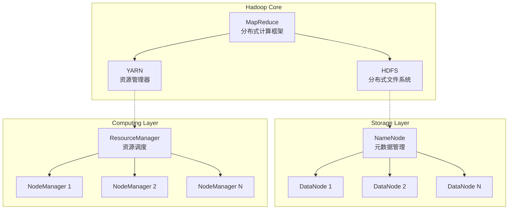

### 2. 三大核心组件

| 组件 | 全称 | 核心功能 | 类比 |
|------|------|----------|------|
| **HDFS** | Hadoop Distributed File System | 分布式文件存储 | 大数据的"硬盘" |
| **YARN** | Yet Another Resource Negotiator | 资源管理与调度 | 大数据的"操作系统" |
| **MapReduce** | Map + Reduce | 分布式并行计算 | 大数据的"编程模型" |

---

## 三、HDFS：分布式文件系统详解

### 1. HDFS 设计理念

HDFS 的设计基于以下核心假设：

> [!IMPORTANT]
> **HDFS 的核心设计原则**
> - **硬件故障是常态**：系统必须能自动检测和恢复
> - **流式数据访问**：一次写入，多次读取
> - **大数据集**：支持 GB/TB/PB 级别的文件
> - **简单一致性模型**：一次写入，不支持随机修改
> - **移动计算比移动数据更划算**：计算向数据靠拢

### 2. HDFS 架构详解

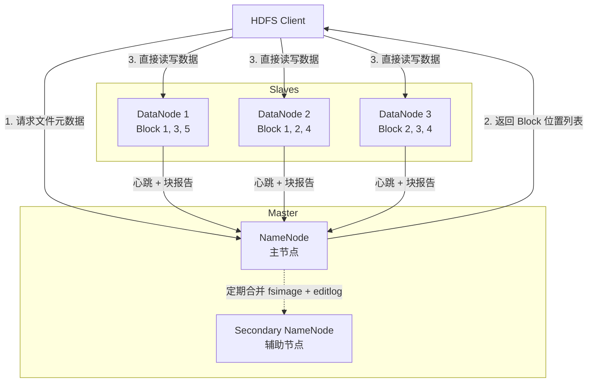

#### 2.1 NameNode（名称节点）

**职责**：管理文件系统的命名空间和元数据

**核心数据结构**：

```java
// 文件系统树（内存中）
FSDirectory
  ├── FSNamesystem（命名空间）
  ├── INodeTree（文件/目录树）
  └── BlockManager（块管理器）

// 持久化数据
FsImage         // 命名空间镜像（定期快照）
EditLog         // 操作日志（实时写入）
```

**元数据示例**：

```
文件路径: /user/hadoop/test.txt
  ├── 文件大小: 300MB
  ├── 副本数: 3
  ├── 块大小: 128MB
  ├── 块列表:
  │     ├── Block_1 (128MB) → [DN1, DN2, DN3]
  │     ├── Block_2 (128MB) → [DN2, DN3, DN4]
  │     └── Block_3 (44MB)  → [DN1, DN3, DN5]
  └── 权限: rwxr-xr-x
```

> [!WARNING]
> **NameNode 是单点故障 (SPOF)**
> 
> 在 Hadoop 1.x 中，NameNode 挂掉会导致整个集群不可用。Hadoop 2.x 引入了 **NameNode HA（高可用）** 机制，通过主备模式解决此问题。

#### 2.2 DataNode（数据节点）

**职责**：存储和管理实际的数据块

**工作流程**：

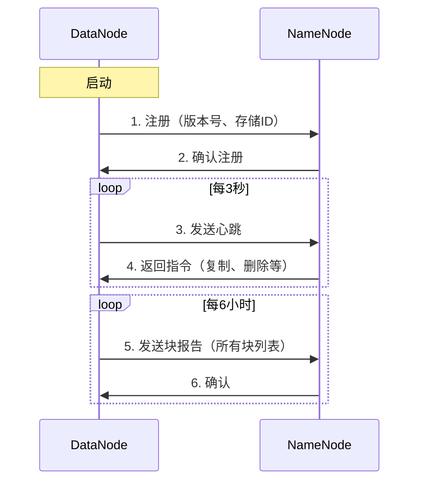

**DataNode 存储结构**：

```
/data/hadoop/dfs/data/
  └── current/
      ├── BP-xxxx-NameNode-xxx/
      │   └── current/
      │       └── finalized/
      │           ├── blk_1073741825        # 数据块文件
      │           ├── blk_1073741825.meta   # 元数据文件（校验和）
      │           ├── blk_1073741826
      │           └── blk_1073741826.meta
      └── VERSION
```

#### 2.3 Secondary NameNode（辅助节点）

> [!CAUTION]
> **常见误解**：Secondary NameNode 不是 NameNode 的备份！

**真实职责**：定期合并 FsImage 和 EditLog，减轻 NameNode 负担

**工作流程**：

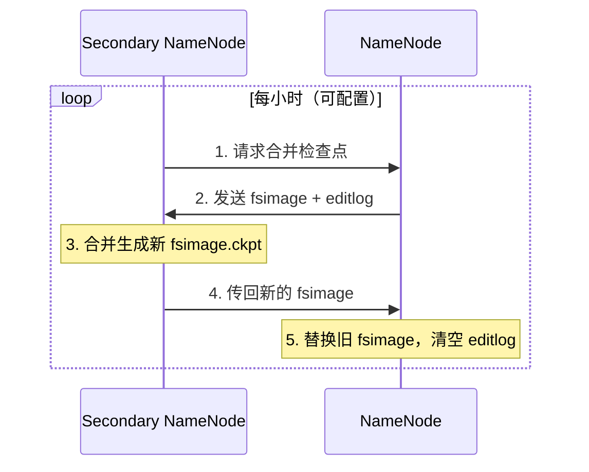

### 3. HDFS 数据读写流程

#### 3.1 写入流程（详细版）

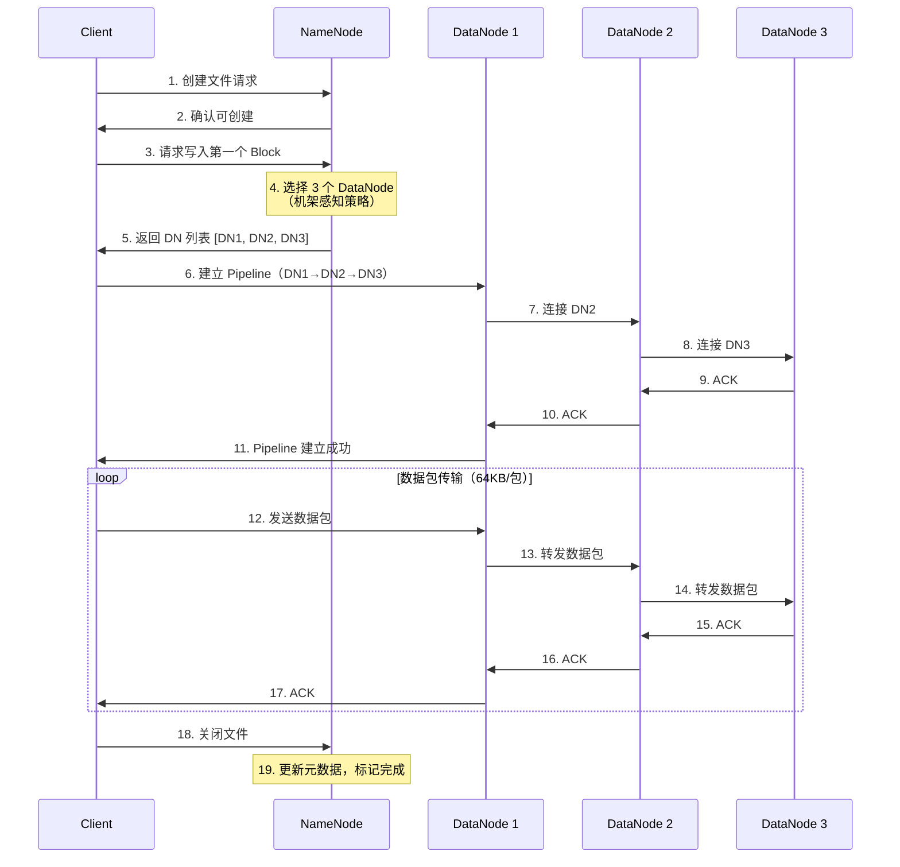

**机架感知策略**（默认副本放置策略）：

```
副本1：Client 所在节点（或同机架随机节点）
副本2：不同机架的随机节点
副本3：与副本2 同机架的不同节点

示例：
Rack1:       Rack2:
  DN1 ✓        DN3 ✓
  DN2 ✓        DN4
```

#### 3.2 读取流程（详细版）

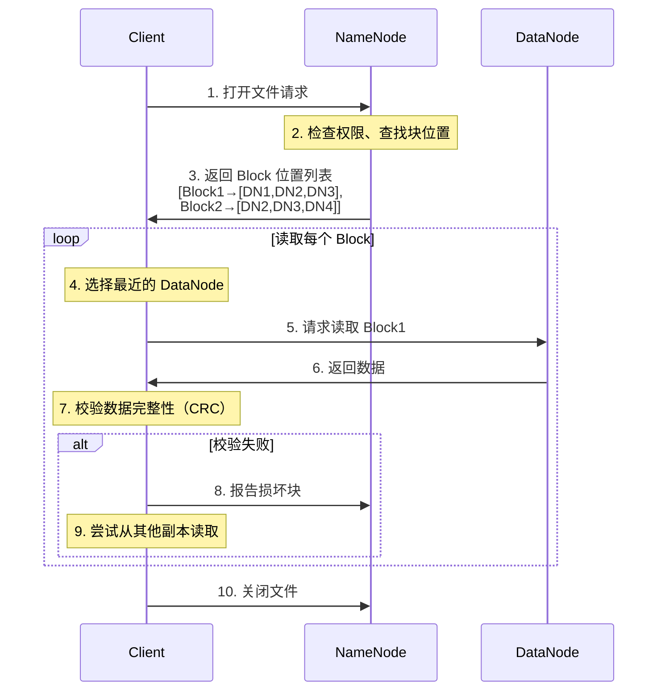

**网络拓扑距离计算**：

```
距离 = 两个节点到最近共同祖先的距离之和

同一节点:      distance = 0
同一机架:      distance = 2
同一数据中心:   distance = 4
不同数据中心:   distance = 6

示例：
/datacenter1/rack1/node1
/datacenter1/rack1/node2  → distance = 2
/datacenter1/rack2/node3  → distance = 4
```

### 4. HDFS 特性总结

| 特性 | 优势 | 局限性 |
|------|------|--------|
| **高容错** | 数据自动多副本，硬件故障自动恢复 | 存储开销大（3倍） |
| **高吞吐** | 适合批处理，GB/s 级别吞吐 | 不适合低延迟访问 |
| **大文件** | 支持 PB 级单文件 | 小文件会消耗大量 NameNode 内存 |
| **流式访问** | 顺序读写性能优秀 | 不支持随机写、文件修改 |
| **可扩展** | 线性扩展到数千节点 | NameNode 内存是瓶颈 |

---

## 四、YARN：资源管理与调度

### 1. YARN 诞生背景

在 Hadoop 1.x 中，MapReduce 既负责资源管理又负责任务调度，导致：
- **单点故障**：JobTracker 挂掉整个集群不可用
- **扩展性差**：无法支持超过 4000 节点
- **资源利用率低**：Map/Reduce Slot 固定分配，浪费严重
- **只支持 MapReduce**：无法运行其他计算框架

**解决方案**：Hadoop 2.0 引入 YARN，实现**计算与资源管理分离**

### 2. YARN 架构

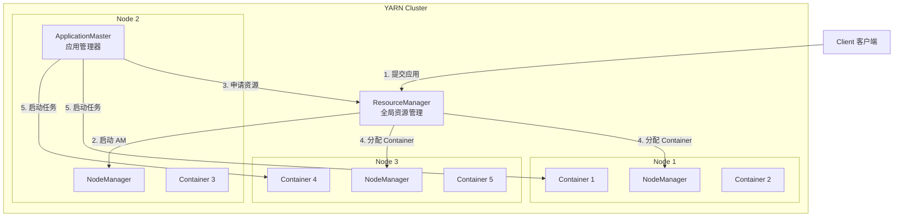

### 3. YARN 核心组件

#### 3.1 ResourceManager（资源管理器）

**职责**：全局资源调度和管理

**核心模块**：

```java
ResourceManager
  ├── ResourceScheduler        // 资源调度器
  │     ├── FIFO Scheduler      // 先进先出
  │     ├── Capacity Scheduler  // 容量调度器（默认）
  │     └── Fair Scheduler      // 公平调度器
  │
  ├── ApplicationsManager      // 应用管理
  │     ├── 接收作业提交
  │     ├── 启动 ApplicationMaster
  │     └── 失败重启
  │
  └── ResourceTrackerService   // 节点管理
        ├── 接收 NodeManager 心跳
        └── 维护节点状态
```

#### 3.2 NodeManager（节点管理器）

**职责**：单节点资源管理和任务执行

**功能**：
- 定期向 ResourceManager 汇报节点状态
- 接收并执行来自 ApplicationMaster 的任务
- 管理 Container 生命周期
- 监控资源使用（CPU、内存）

#### 3.3 ApplicationMaster（应用管理器）

**职责**：单个应用的生命周期管理（每个应用一个）

**功能**：
- 向 ResourceManager 申请资源
- 与 NodeManager 通信启动 Container
- 监控任务状态，处理失败重试
- 任务完成后释放资源

#### 3.4 Container（容器）

**定义**：资源抽象，包含 CPU、内存、磁盘等

```
Container = <NodeId, CPU cores, Memory, Priority, Token>

示例：
Container_001:
  - Node: node1.example.com
  - CPU: 2 cores
  - Memory: 4GB
  - Priority: 5
```

### 4. YARN 应用执行流程

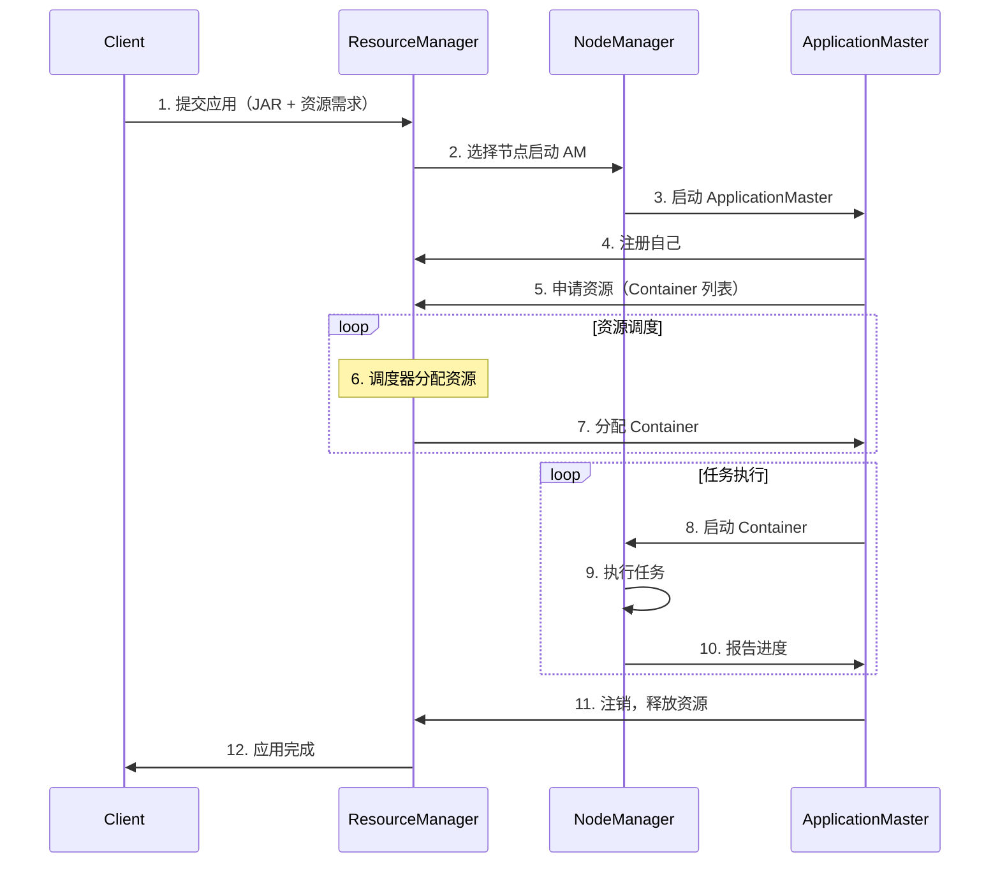

---

## 五、MapReduce：分布式计算框架

### 1. MapReduce 编程模型

MapReduce 是一种**编程模型**，用于处理和生成大数据集。

**核心思想**：分而治之（Divide and Conquer）

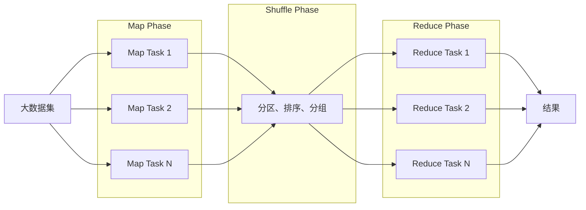

### 2. 经典案例：WordCount

**需求**：统计文本中每个单词出现的次数

**输入数据**：
```
hello world
hello hadoop
hadoop mapreduce
```

**MapReduce 处理过程**：

```
┌──────────────────────────────────────────────────────────────┐
│ Input Split 1: "hello world"                                 │
│ Input Split 2: "hello hadoop"                                │
│ Input Split 3: "hadoop mapreduce"                            │
└──────────────────────────────────────────────────────────────┘
                           │
                           ▼
┌──────────────────────────────────────────────────────────────┐
│ Map Phase（并行执行）                                          │
│                                                               │
│ Mapper 1: "hello world"                                      │
│   → (hello, 1), (world, 1)                                   │
│                                                               │
│ Mapper 2: "hello hadoop"                                     │
│   → (hello, 1), (hadoop, 1)                                  │
│                                                               │
│ Mapper 3: "hadoop mapreduce"                                 │
│   → (hadoop, 1), (mapreduce, 1)                              │
└──────────────────────────────────────────────────────────────┘
                           │
                           ▼
┌──────────────────────────────────────────────────────────────┐
│ Shuffle & Sort Phase（分区、排序、分组）                        │
│                                                               │
│ Partition 1:                                                 │
│   hadoop → [1, 1]                                            │
│   hello  → [1, 1]                                            │
│                                                               │
│ Partition 2:                                                 │
│   mapreduce → [1]                                            │
│   world     → [1]                                            │
└──────────────────────────────────────────────────────────────┘
                           │
                           ▼
┌──────────────────────────────────────────────────────────────┐
│ Reduce Phase（并行聚合）                                       │
│                                                               │
│ Reducer 1:                                                   │
│   hadoop: [1, 1] → (hadoop, 2)                               │
│   hello: [1, 1]  → (hello, 2)                                │
│                                                               │
│ Reducer 2:                                                   │
│   mapreduce: [1] → (mapreduce, 1)                            │
│   world: [1]     → (world, 1)                                │
└──────────────────────────────────────────────────────────────┘
                           │
                           ▼
┌──────────────────────────────────────────────────────────────┐
│ Output:                                                      │
│   hadoop      2                                              │
│   hello       2                                              │
│   mapreduce   1                                              │
│   world       1                                              │
└──────────────────────────────────────────────────────────────┘
```

**代码实现**：

```java
// Mapper 类
public class WordCountMapper 
    extends Mapper<LongWritable, Text, Text, IntWritable> {
    
    private final static IntWritable one = new IntWritable(1);
    private Text word = new Text();
    
    @Override
    public void map(LongWritable key, Text value, Context context) 
        throws IOException, InterruptedException {
        
        String line = value.toString();
        String[] words = line.split("\\s+");
        
        for (String w : words) {
            word.set(w);
            context.write(word, one);  // 输出 (word, 1)
        }
    }
}

// Reducer 类
public class WordCountReducer 
    extends Reducer<Text, IntWritable, Text, IntWritable> {
    
    @Override
    public void reduce(Text key, Iterable<IntWritable> values, Context context) 
        throws IOException, InterruptedException {
        
        int sum = 0;
        for (IntWritable val : values) {
            sum += val.get();
        }
        
        context.write(key, new IntWritable(sum));  // 输出 (word, count)
    }
}

// Driver 类
public class WordCount {
    public static void main(String[] args) throws Exception {
        Configuration conf = new Configuration();
        Job job = Job.getInstance(conf, "word count");
        
        job.setJarByClass(WordCount.class);
        job.setMapperClass(WordCountMapper.class);
        job.setReducerClass(WordCountReducer.class);
        
        job.setOutputKeyClass(Text.class);
        job.setOutputValueClass(IntWritable.class);
        
        FileInputFormat.addInputPath(job, new Path(args[0]));
        FileOutputFormat.setOutputPath(job, new Path(args[1]));
        
        System.exit(job.waitForCompletion(true) ? 0 : 1);
    }
}
```

### 3. MapReduce 执行流程（详细）

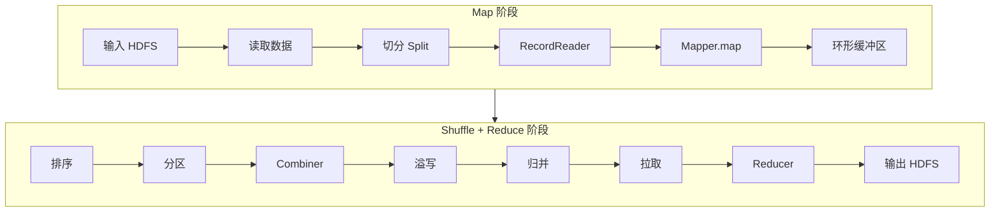

---

## 六、Hadoop 生态系统

Hadoop 核心只是基础，围绕它形成了庞大的生态系统：

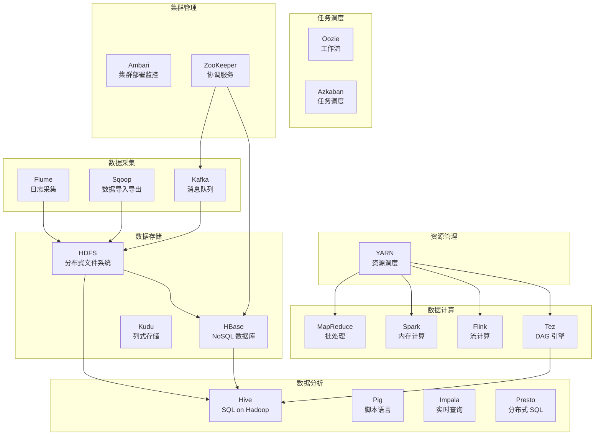

### 主要组件功能对比

| 组件 | 类型 | 核心功能 | 适用场景 |
|------|------|----------|---------|
| **Hive** | SQL 引擎 | 将 SQL 转换为 MapReduce/Tez | 离线数据仓库、批量分析 |
| **HBase** | NoSQL 数据库 | 实时读写、列式存储 | 实时查询、时序数据 |
| **Spark** | 计算引擎 | 内存计算、DAG 执行 | 迭代计算、机器学习 |
| **Flink** | 流处理 | 真正的流计算 | 实时数据处理、事件处理 |
| **Flume** | 数据采集 | 日志收集、传输 | 日志聚合、ETL |
| **Sqoop** | 数据同步 | RDBMS ↔ Hadoop | 数据迁移、备份 |
| **ZooKeeper** | 协调服务 | 配置管理、选举 | 分布式锁、NameNode HA |

---

## 七、Hadoop 应用场景

### 1. 典型应用场景

| 场景 | 使用技术 | 案例 |
|------|---------|------|
| **日志分析** | HDFS + MapReduce/Spark + Hive | 网站用户行为分析、广告点击分析 |
| **推荐系统** | HDFS + Spark MLlib + HBase | 电商商品推荐、视频内容推荐 |
| **数据仓库** | HDFS + Hive + Impala | 企业 BI 分析、报表生成 |
| **搜索引擎** | HDFS + MapReduce + HBase + Solr | 全文检索、倒排索引构建 |
| **实时计算** | Kafka + Flink + HBase | 实时监控、实时风控 |
| **机器学习** | HDFS + Spark MLlib | 分类、聚类、协同过滤 |

### 2. 企业实践案例

#### 案例 1：淘宝搜索日志分析

```
数据流向：
用户行为 
  → Flume 采集 
  → Kafka 缓冲 
  → Spark Streaming 实时处理 
  → HBase 存储 
  → Hive 离线分析 
  → 可视化报表
```

#### 案例 2：推荐系统

```
离线训练：
HDFS 历史数据 
  → Spark MLlib 协同过滤 
  → 模型输出到 HBase

在线服务：
用户请求 
  → HBase 查询推荐结果 
  → 返回 Top-N 推荐
```

---

## 八、Hadoop 优缺点分析

### 优势

| 优势 | 说明 |
|------|------|
| ✅ **高可靠性** | 数据多副本，自动容错 |
| ✅ **高扩展性** | 可扩展到数千节点 |
| ✅ **成本低** | 基于廉价 x86 服务器 |
| ✅ **生态丰富** | 数百个开源项目支持 |
| ✅ **开源免费** | Apache 开源，社区活跃 |

### 局限性

| 局限性 | 说明 | 解决方案 |
|--------|------|---------|
| ❌ **小文件问题** | 大量小文件消耗 NN 内存 | HAR 归档、SequenceFile |
| ❌ **不适合低延迟** | MapReduce 启动慢 | 使用 Spark、Impala |
| ❌ **不支持修改** | 只能追加，不能更新 | 使用 HBase、Kudu |
| ❌ **NameNode 瓶颈** | 单节点内存限制 | Federation、NameNode HA |
| ❌ **学习曲线陡** | 体系复杂，配置繁琐 | 使用 Ambari、CDH/HDP 发行版 |

---

## 九、Hadoop 版本演进

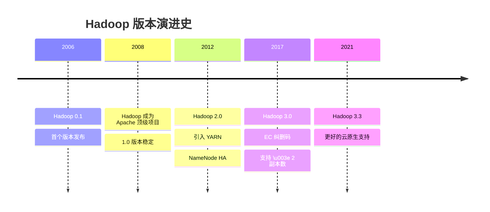

### 主要版本对比

| 特性 | Hadoop 1.x | Hadoop 2.x | Hadoop 3.x |
|------|-----------|-----------|-----------|
| **YARN** | ❌ | ✅ | ✅ |
| **NameNode HA** | ❌ | ✅ | ✅ |
| **Federation** | ❌ | ✅ | ✅ |
| **纠删码 EC** | ❌ | ❌ | ✅ |
| **最小副本数** | 3 | 3 | 可配置 |
| **最大节点数** | ~4000 | ~10000 | ~10000+ |

> [!TIP]
> **生产环境推荐**
> 
> - 新项目：直接使用 **Hadoop 3.x**
> - 存量系统：谨慎升级，充分测试
> - 云环境：考虑托管服务（EMR、HDInsight、CDH）

---

## 十、学习建议与实践路径

### 1. 学习路线图

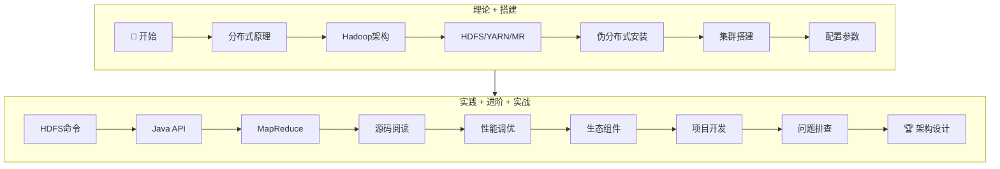

### 2. 推荐资源

#### 📚 必读书籍

1. **《Hadoop 权威指南》**（第4版）- Tom White
   - 被誉为 Hadoop "圣经"，全面深入

2. **《Hadoop 技术内幕》**（深入解析 YARN 架构设计与实现原理）- 董西成
   - 深入源码级别，适合进阶

3. **《大数据：互联网大规模数据挖掘与分布式处理》** - 斯坦福大学经典教材

#### 🔗 在线资源

- **官方文档**：https://hadoop.apache.org/docs/
- **GitHub 源码**：https://github.com/apache/hadoop
- **Cloudera 教程**：https://www.cloudera.com/tutorials.html

#### 💻 实践建议

> [!IMPORTANT]
> **动手实践比阅读更重要！**
> 
> 1. 先在本地搭建伪分布式环境
> 2. 完成至少 10 个 MapReduce 程序
> 3. 阅读 NameNode、DataNode 核心源码
> 4. 参与开源社区，提交 PR

### 3. 源码阅读建议（基于您的工作区）

根据您当前的 Hadoop 源码工作区，推荐的阅读路径：

#### 第一阶段：HDFS 核心流程

```
1. HDFS 客户端 API
   /hadoop-hdfs-project/hadoop-hdfs-client/src/main/java/org/apache/hadoop/hdfs/
   ├── DistributedFileSystem.java   # 用户入口
   └── DFSClient.java                # 核心实现

2. NameNode 核心
   /hadoop-hdfs-project/hadoop-hdfs/src/main/java/org/apache/hadoop/hdfs/server/namenode/
   ├── NameNode.java                 # 主类
   ├── FSNamesystem.java             # 命名空间管理
   └── FSDirectory.java              # 目录树

3. DataNode 核心
   /hadoop-hdfs-project/hadoop-hdfs/src/main/java/org/apache/hadoop/hdfs/server/datanode/
   ├── DataNode.java                 # 主类
   └── BlockManager.java             # 块管理
```

#### 第二阶段：YARN 资源调度

```
/hadoop-yarn-project/hadoop-yarn/hadoop-yarn-server/
├── hadoop-yarn-server-resourcemanager/    # ResourceManager
├── hadoop-yarn-server-nodemanager/        # NodeManager
└── hadoop-yarn-server-applicationmaster/  # ApplicationMaster
```

---

## 十一、总结

Hadoop 作为**大数据时代的基石**,虽然不再是最热门的技术，但其设计思想和架构理念依然深刻影响着整个大数据生态。

### 核心要点回顾

1. **HDFS**：解决海量数据**存储**问题
   - NameNode/DataNode 主从架构
   - 数据块 + 多副本机制
   - 适合大文件顺序读写

2. **YARN**：解决集群**资源管理**问题
   - ResourceManager/NodeManager 架构
   - 支持多种计算框架
   - 灵活的资源调度策略

3. **MapReduce**：解决大数据**计算**问题
   - 分而治之的编程模型
   - Map → Shuffle → Reduce
   - 适合离线批处理

4. **生态系统**：丰富的工具链
   - Hive（SQL）、HBase（NoSQL）
   - Spark（内存计算）、Flink（流处理）
   - 覆盖数据采集、存储、计算、分析全链路

### 下一步行动

- [ ] 搭建本地 Hadoop 环境（伪分布式）
- [ ] 完成 WordCount 示例编程
- [ ] 学习 HDFS 命令行操作
- [ ] 阅读 NameNode/DataNode 源码
- [ ] 学习 Hive/HBase 等生态组件

---

**本文是 Hadoop 完全指南系列的第一篇**，后续将深入讲解：
- **第二篇**：HDFS 源码深度解析（NameNode 启动流程、写入流程）
- **第三篇**：YARN 资源调度源码剖析
- **第四篇**：MapReduce 执行原理与性能优化
- **第五篇**：Hadoop 线上运维与故障排查

---

**如果你觉得本文有帮助，欢迎点赞、收藏、关注！如有任何疑问或建议，欢迎在评论区留言交流！**

> 📧 **联系方式**：欢迎通过 GitHub 或邮件交流大数据技术
> 
> 🔗 **系列更新**：请持续关注本博客，获取最新的 Hadoop 深度解析文章
